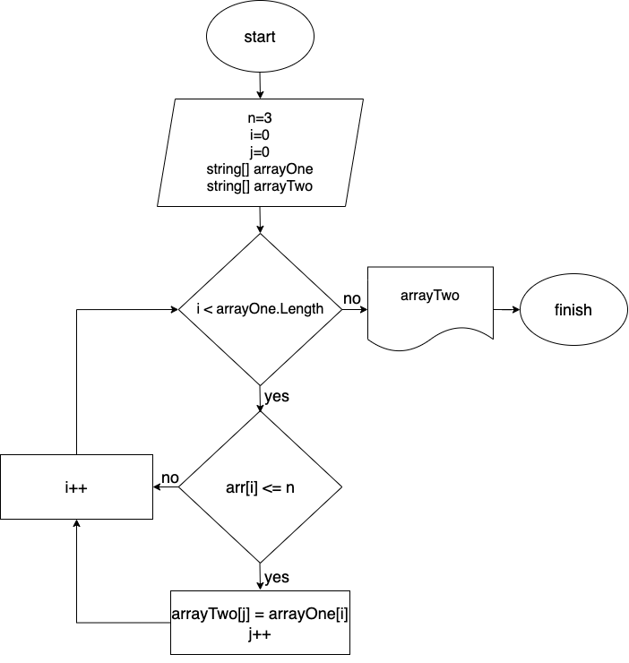

 # Итоговая работа 

 ## Задача: 
Написать программу, которая из имеющегося массива строк формирует новый массив из строк, длина которых меньше, либо равна 3 символам. Первоначальный массив можно ввести с клавиатуры, либо задать на старте выполнения алгоритма. При решении не рекомендуется пользоваться коллекциями, лучше обойтись исключительно массивами.

**Примеры:**
[“Hello”, “2”, “world”, “:-)”] → [“2”, “:-)”]
[“1234”, “1567”, “-2”, “computer science”] [“-2”]
[“Russia”, “Denmark”, “Kazan”] → []

## Алгоритм решения:
1. Создали строковый массив.
2. Создали метод, заполняющий массив (*FormArray*), заполняющий массив значениями введенными пользлвателем.
3. Создали метод вывода заполненного массива поэлементно на экран (*PrintArray*).
4. Создали метод, определяющий длину нового массива (*SizeSecondArray*).
5. Создали условие окончания решения, если размер второго массива равен нулю.
6. Создали метод, переносящий определенные по условию задания элементы из изначального массива в новый (*TransferElements*).
7. Вывели на экран новый массив.

# Дополнительная информация
Добавили блок-схему решения задачи:

